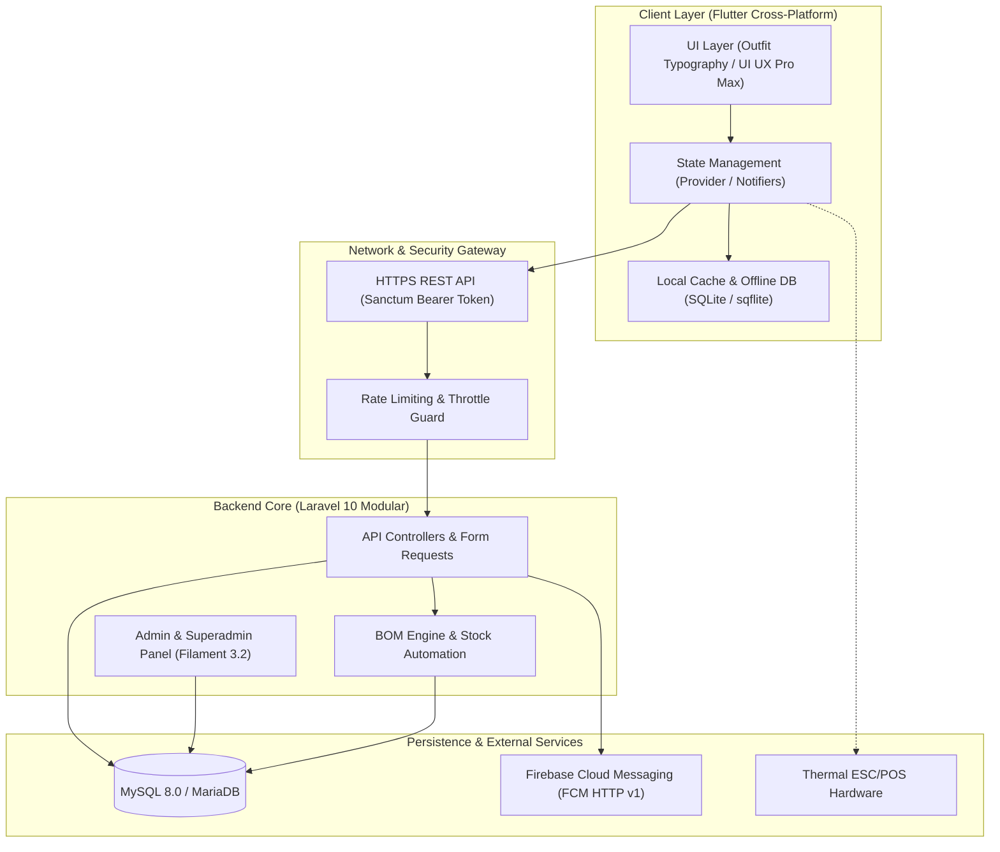

<div align="center">

# ⚡ Zenvi — Modern Cloud POS & ERP Platform
### *Enterprise-Grade Multi-Tenant Point of Sale, Inventory BOM, & Operations Management*

[](https://flutter.dev)
[](https://dart.dev)
[](https://laravel.com)
[](https://filamentphp.com)
[](https://mysql.com)
[](#-uiux-pro-max-design-system)

<p align="center">
  <b>Sistem Kasir (POS) Cloud & Manajemen Bisnis Multi-Tenant Terpadu</b><br>
  Dirancang khusus untuk skala operasional F&B, Ritel, dan Jasa dengan ketahanan <i>Offline-First</i>, otomasi resep bahan baku (BOM), Kitchen Display System real-time, dan presensi geofencing berbasis Face Detection.
</p>

[Fitur Utama](#-fitur-unggulan-sistem) • [Arsitektur UI/UX](#-uiux-pro-max-design-system) • [Diagram Sistem](#-arsitektur-dan-alur-data) • [Tech Stack](#-teknologi--pustaka-inti) • [Panduan Setup](#-panduan-instalasi-lokal)

---

</div>

## 🌟 Fitur Unggulan Sistem

### 1. Point of Sale (POS) & Hardware Integration
- **Offline-First Synchronization:** Transaksi kasir tetap aktif tanpa hambatan saat koneksi internet terputus menggunakan database lokal **SQLite**, dan otomatis tersinkronisasi kembali saat jaringan online.
- **ESC/POS Thermal Printing:** Pencetakan struk instan via **Bluetooth & USB Thermal Printer** dengan kalkulasi byte presisi tanpa lagging.
- **Multi-Metode Pembayaran:** Dukungan transaksi Tunai (*cash drawer calculation*), QRIS Dinamis/Statis, dan Transfer Bank.
- **Kitchen Display System (KDS):** Pembaruan status pesanan real-time untuk divisi dapur dengan pemilahan antrean otomatis per kategori item.

### 2. Manajemen Inventaris & Otomasi Resep (BOM)
- **Bill of Materials (BOM) Engine:** Pemotongan kuantitas bahan baku gramasi/mililiter secara real-time dan otomatis di background setiap kali pesanan menu terjual.
- **Wastage & Stock Opname:** Pencatatan bahan baku terbuang/rusak dengan audit log akurat untuk mencegah kebocoran profit outlet.
- **Multi-Outlet & Multi-Warehouse:** Pemantauan dan mutasi stok antar cabang dalam satu dashboard terpadu.

### 3. Presensi Cerdas & Kepegawaian (HR & Shift)
- **Biometric Face Verification:** Validasi presensi selfie menggunakan **Google ML Kit Face Detection** untuk memastikan kehadiran fisik karyawan.
- **Geofencing GPS Radius:** Pembatasan presensi dalam radius meter outlet menggunakan koordinat presisi.
- **Blind Closing & Petty Cash:** Pengelolaan kas modal awal dan rekonsiliasi kas akhir shift tanpa pembocoran total omzet ke kasir.

### 4. Loyalitas Member & Menu Publik
- **Katalog Menu Digital Scan QR:** Pelanggan dapat memesan langsung dari meja tanpa instalasi aplikasi.
- **Tier Membership & Poin Belanja:** Akumulasi reward poin otomatis setiap kelipatan transaksi.

---

## 🎨 UI/UX Pro Max Design System

Aplikasi mobile/tablet Zenvi dibangun di atas standar desain antarmuka **UI/UX Pro Max** untuk menjamin estetika kelas dunia, ergonomi sentuhan jari yang nyaman, dan stabilitas visual:

```
┌────────────────────────────────────────────────────────────────────────┐
│ UI/UX PRO MAX SPECIFICATION                                            │
├─────────────────────────────────┬──────────────────────────────────────┤
│ 📐 Typography Scale             │ Outfit (Display w800, Body w400/500) │
│ 🛡️ Text Scaling Guard           │ Clamped (0.85x – 1.15x Max Factor)   │
│ 🪟 Header & Glassmorphism       │ 56dp / 64dp + Backdrop Blur σ: 16.0  │
│ 👆 Touch Target Ergonomics      │ Min 44x44 dp (Zero misclick layout)  │
│ 🫧 Card Elevation & Shadows      │ Surface Border 0.08a + Blur 12dp     │
│ ⛵ Floating Navigation Pill      │ Scaffold extendBody + Bottom 120dp   │
└─────────────────────────────────┴──────────────────────────────────────┘
```

- **Text Scaling Protection:** Seluruh hierarki teks dibungkus `textScaler.clamp` agar tampilan tetap simetris dan rapi meskipun ukuran font aksesibilitas pengguna di Android/iOS diubah ke ukuran ekstrem.
- **Frosted Glass Navigation:** Header transparan modern dengan efek *blur backdrop filter* yang responsif terhadap pergerakan scroll konten.

---

## 🏗️ Arsitektur dan Alur Data



---

## 🛠️ Teknologi & Pustaka Inti

| Sektor | Teknologi | Kegunaan |
| :--- | :--- | :--- |
| **Mobile / Tablet** | **Flutter 3.x (Dart)** | Aplikasi Kasir POS & KDS multi-platform (Android, iOS, Desktop) |
| **State Management** | **Provider** | Pengelolaan state reaktif, cart lifecycle, dan network caching |
| **Local Storage** | **sqflite & shared_preferences** | Database lokal SQLite transaksi offline-first |
| **Hardware Driver** | **blue_thermal_printer & esc_pos_utils** | Komunikasi printer Bluetooth dan formatting struk thermal ESC/POS |
| **AI Vision & Geolocation** | **Google ML Kit & Geolocator** | Deteksi wajah presensi dan geofencing GPS radius |
| **Backend Core** | **Laravel 10 (PHP 8.2)** | RESTful API terisolasi tenant (`company_id`, `branch_id`) |
| **Admin Panel** | **Filament 3.2** | Panel manajemen backoffice, outlet, produk, dan laporan analitik |
| **Push Notification** | **Firebase HTTP v1 (OAuth2)** | Pengiriman push notification real-time ke staf dan owner |
| **Autentikasi** | **Laravel Sanctum** | Token-based auth aman dengan expiry & CSRF protection |

---

## 📁 Struktur Direktori

```text
zenvi/
├── frontend_pos/                  # Aplikasi Kasir Mobile & Tablet (Flutter)
│   ├── lib/
│   │   ├── core/                  # Theme, Constants, Custom Painters, Utils
│   │   ├── database/              # SQLite Helper & Offline Schema Migrations
│   │   ├── models/                # Data Models (Product, Order, Shift, BOM)
│   │   ├── providers/             # State Providers (Cart, Auth, Shift, Printer)
│   │   ├── screens/               # Layar POS, KDS, Presensi, Riwayat, Laporan
│   │   ├── services/              # API Client, Bluetooth Printer, Face Detection
│   │   └── widgets/               # Komponen UI UX Pro Max (Buttons, Headers, Cards)
│   └── pubspec.yaml
├── backend/                       # RESTful API & Admin Panel (Laravel 10)
│   ├── app/
│   │   ├── Filament/              # Resource & Page Backoffice Filament
│   │   ├── Http/Controllers/Api/  # Endpoint REST API POS, KDS, & Public Menu
│   │   ├── Models/                # Eloquent Models & Relasi Multi-Tenant
│   │   └── Services/              # Logika Bisnis BOM, Presensi, & Laporan
│   ├── config/                    # Konfigurasi database, auth, & caching
│   ├── database/                  # Migrasi & Seeder Database
│   └── routes/                    # Definisi Route API & Web
└── playstore_assets/              # Metadata & Aset Publikasi Toko Aplikasi
```

---

## 💻 Panduan Instalasi Lokal

### Prasyarat:
- **PHP** >= 8.1 (ekstensi: `pdo_mysql`, `gd`, `mbstring`, `openssl`, `curl`)
- **Composer** >= 2.x
- **MySQL** >= 8.0 atau **MariaDB** >= 10.4
- **Flutter SDK** >= 3.x

### 1. Setup Backend (Laravel)
```bash
# Masuk ke direktori backend
cd backend

# Install dependensi PHP
composer install

# Siapkan berkas environment lokal
cp .env.example .env
php artisan key:generate

# Konfigurasikan kredensial DB lokal pada .env, lalu jalankan migrasi:
php artisan migrate --seed

# Hubungkan symbolic link storage & jalankan server lokal:
php artisan storage:link
php artisan serve
```
*Panel admin Filament dapat diakses melalui browser di:* `http://127.0.0.1:8000/admin`

### 2. Setup Frontend POS (Flutter)
```bash
# Masuk ke direktori frontend
cd frontend_pos

# Ambil dependensi Flutter
flutter pub get

# Jalankan static analysis untuk memastikan kode bersih
flutter analyze

# Jalankan pada emulator atau perangkat fisik (Android / iOS / Desktop)
flutter run
```

---

## 🔒 Standar Keamanan & Kode Bersih
- **Zero Hardcoded Secrets:** Seluruh API Key, database credentials, dan service account dimuat secara dinamis via environment variable (`.env`).
- **Data Isolation:** Akses data dikunci ketat pada level middleware dan Eloquent Global Scope berdasarkan tenant perusahaan.
- **Fail-Safe Offline Mode:** Data transaksi offline dienkripsi pada storage lokal sebelum diunggah ke server.

---

<div align="center">
  <sub>Didesain dan dikembangkan dengan dedikasi untuk ekosistem UMKM modern. Hak Cipta Terpelihara.</sub>
</div>
